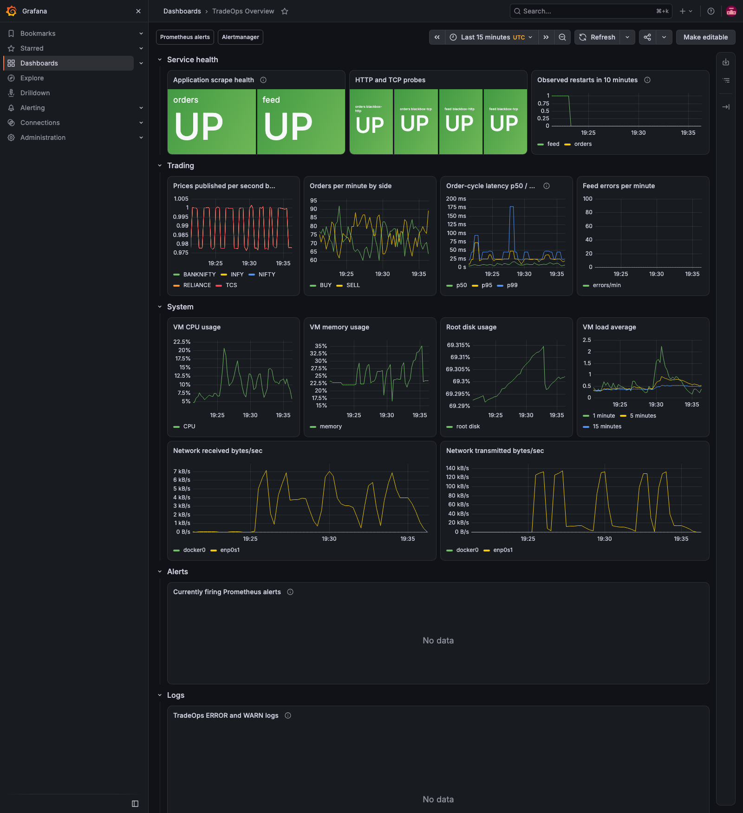
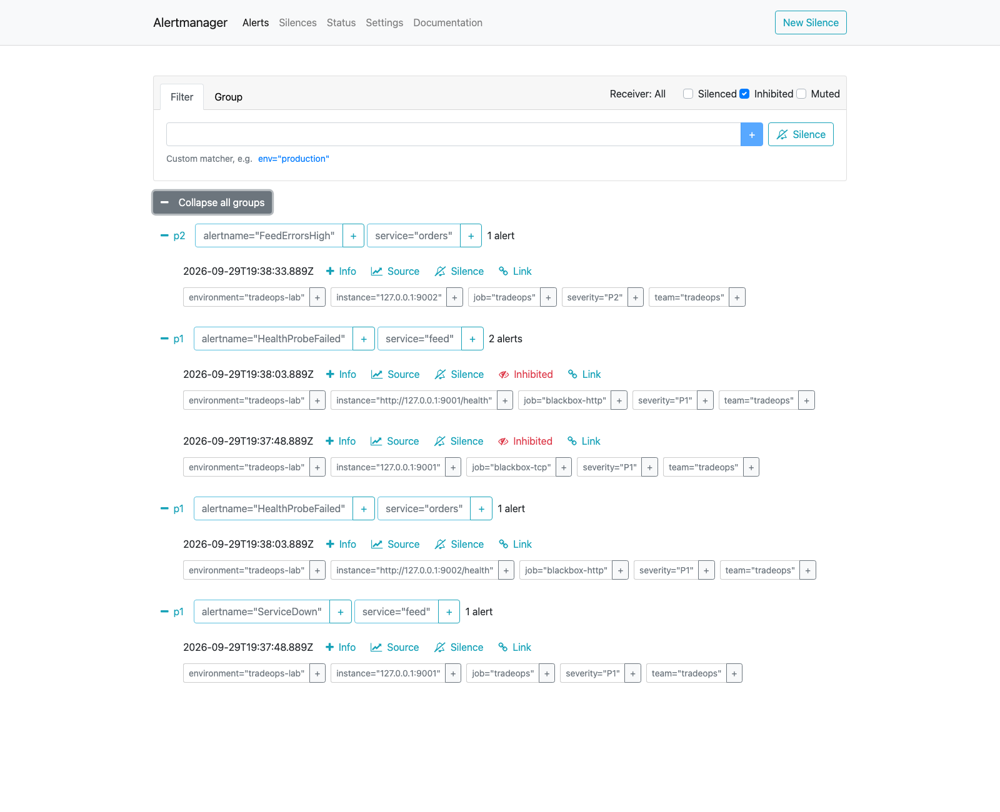
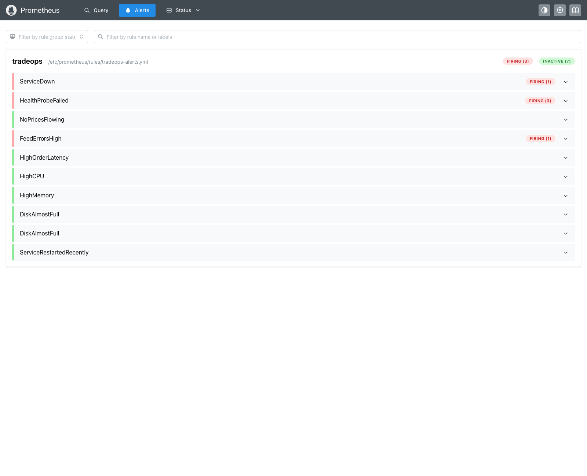
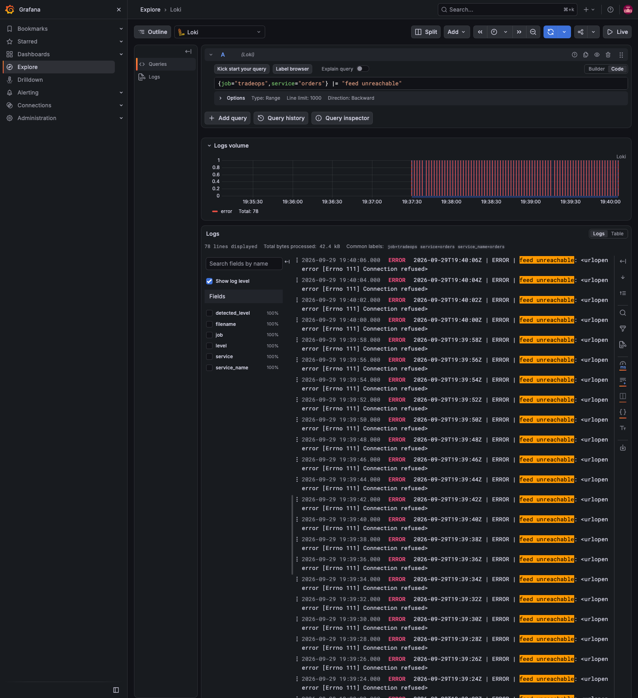
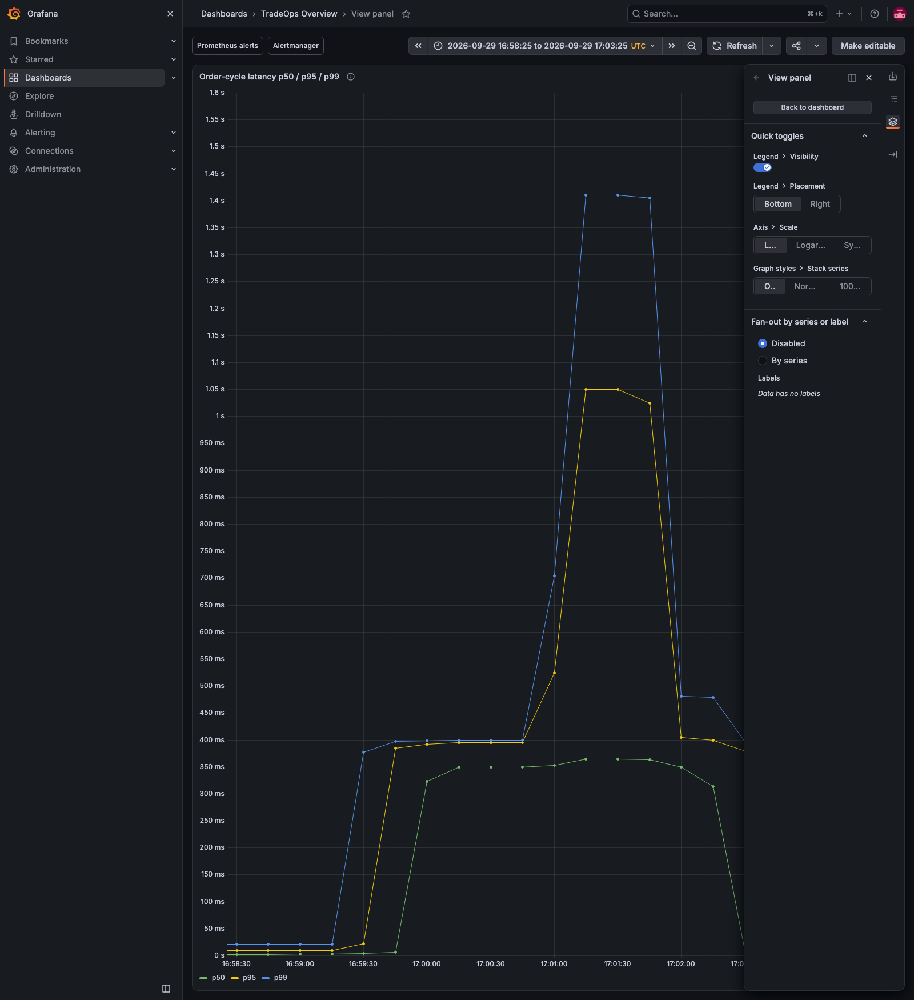
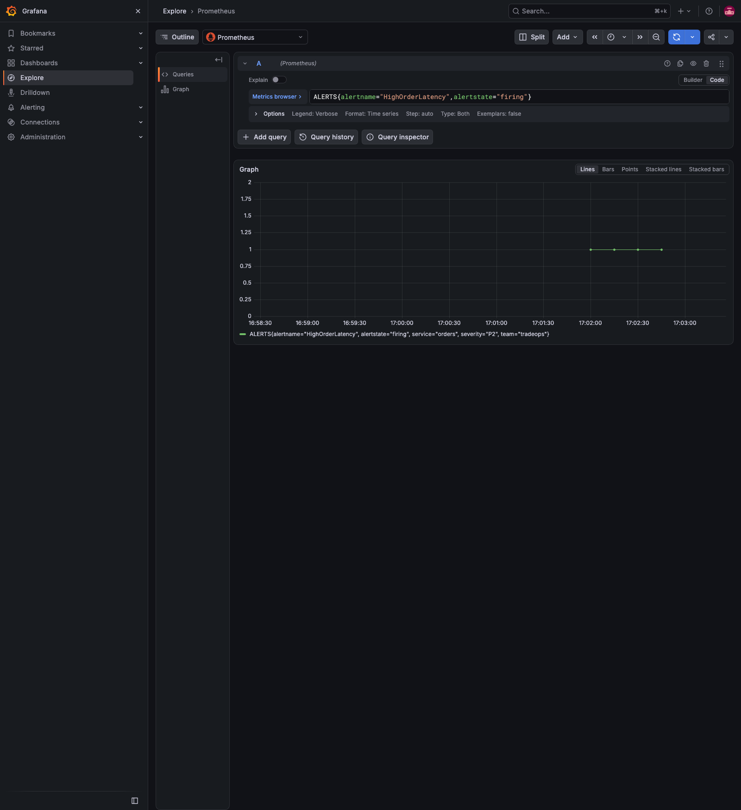

# TradeOps Watch — Linux Monitoring & Incident Response Lab

An L1 DevOps / production support portfolio project: operate two synthetic
trading services, detect failures, debug Linux, follow runbooks, record incidents,
and hand over a shift. Built for an Apple Silicon Mac with Ubuntu in Multipass.
No real trading or broker connections. Phase 1 used only the Python standard
library and Bash; Phase 2 adds Docker monitoring, application metrics,
versioned deployments with rollback, CI, and seven real chaos drills while
keeping every Phase 1 operations tool.

**Phase 2:** see [monitoring setup and URLs](monitoring/README.md),
[progress and verification](docs/phase2-progress.md), and the
[incident evidence index](docs/evidence/phase2/README.md).

[](https://github.com/Sudheer3135/tradeops-watch/actions/workflows/ci.yml)

The badge shows the hosted GitHub Actions result once the repository is pushed.
The same checks passed locally inside Ubuntu:
[step9-ci.txt](docs/evidence/phase2/step9-ci.txt).

```text
MacBook M2 -> Multipass Ubuntu VM (2 CPUs, 4 GB RAM)
  systemd -> current release -> feed :9001 <- orders :9002
                                 | /metrics       | /metrics
  node_exporter + blackbox ------+----------------+
                                 v
                            Prometheus -> Alertmanager -> Telegram (optional)
                                 |
                                 v
                              Grafana <------- Loki <------- Alloy <--- logs
  cron -> healthcheck -> alerts / runbooks / handover             ^
  deploy -> versioned code -> health gate -> rollback ---------- logs
```

[Architecture details](docs/architecture.md) · [Interview guide](LEARNING.md)

## Tech used

Python 3 standard library (`http.server`, `urllib`, `logging`, threads), Bash,
Ubuntu 24.04 ARM64, systemd, cron, curl, iproute2/ss/tc, iptables, logrotate,
and Git. Phase 2 adds pinned `prometheus-client` in a virtual environment and
seven pinned monitoring containers. Both application HTTP listeners remain VM-local.

## Start from scratch (Mac terminal)

```bash
cd '/Users/sudheer/Desktop/TradeOps Watch'
multipass launch 24.04 --name tradeops --cpus 2 --memory 4G --disk 10G
multipass mount "$PWD" tradeops:/home/ubuntu/tradeops-watch
multipass exec tradeops -- sudo bash /home/ubuntu/tradeops-watch/scripts/install.sh
```

If the VM already exists, use `multipass start tradeops` instead of launch.
If mounting reports privileged mounts are disabled:

```bash
multipass set local.privileged-mounts=true
multipass mount "$PWD" tradeops:/home/ubuntu/tradeops-watch
```

On this Mac, the mount was created but reads failed with `Operation not permitted`
(macOS Desktop privacy protection). The tested fallback below copies the source
without changing global privacy permissions:

```bash
multipass umount tradeops:/home/ubuntu/tradeops-watch
COPYFILE_DISABLE=1 tar --exclude=.git --exclude=__pycache__ --exclude=.venv --exclude=.pytest_cache --exclude=.ruff_cache --exclude=.env --exclude=secrets --exclude=generated -czf /tmp/tradeops-watch-source.tar.gz .
multipass transfer /tmp/tradeops-watch-source.tar.gz tradeops:/home/ubuntu/tradeops-watch-source.tar.gz
multipass exec tradeops -- bash -lc 'mkdir -p /home/ubuntu/tradeops-watch && tar --no-same-owner -xzf /home/ubuntu/tradeops-watch-source.tar.gz -C /home/ubuntu/tradeops-watch'
multipass exec tradeops -- sudo bash /home/ubuntu/tradeops-watch/scripts/install.sh
```

Repeat the archive/transfer/extract steps after editing source on the Mac, then
rerun install. This is a copy, so VM evidence must also be copied back with
`multipass transfer`. If you prefer a live mount, grant Multipass access in
macOS System Settings → Privacy & Security → Full Disk Access, restart Multipass,
and retry mounting; that broader permission was not changed for this project.

Alternative: after publishing, clone the repository inside the VM at
`/home/ubuntu/tradeops-watch`, then run the same installer. The installer is
safe to rerun; it restarts both services to load changes. Service code lives in
`/opt/tradeops`, logs in `/var/log/tradeops`, monitor state in `/var/lib/tradeops`.
Times in application logs, alerts, and reports are UTC.

## Quick demo (Mac terminal)

```bash
multipass exec tradeops -- systemctl --no-pager status tradeops-feed tradeops-orders
multipass exec tradeops -- curl -fsS http://127.0.0.1:9001/prices
multipass exec tradeops -- curl -fsS http://127.0.0.1:9002/health
multipass exec tradeops -- sudo /opt/tradeops/scripts/healthcheck.sh
multipass exec tradeops -- sudo /opt/tradeops/scripts/log_search.sh latency
multipass exec tradeops -- sudo /opt/tradeops/scripts/handover_report.py --hours 8
```

For a failure demo, open `multipass shell tradeops`, then use these commands
**inside the VM**. Run only one drill at a time.

| Break command (prefix `sudo /opt/tradeops/scripts/chaos.sh`) | Expected check | Fix subcommand |
|---|---|---|
| `kill-feed` | P1 if checked during outage; P2 `restart-feed` after recovery | `fix-feed` (normally auto-restarts in 5s) |
| `stop-feed` | P1 `service-feed`, missing port and HTTP | `fix-feed` |
| `fill-disk` | P2 `disk`, default 85% | `fix-disk` |
| `cpu-spike` | P2 `cpu`, default 85% | `fix-cpu` (also expires automatically) |
| `block-port` | P1 HTTP failure while listener still exists | `fix-port` |
| `net-delay` | Slow/unreachable feed; degraded orders and/or HTTP timeout | `fix-delay` |

```bash
sudo /opt/tradeops/scripts/chaos.sh stop-feed
sleep 5
sudo /opt/tradeops/scripts/healthcheck.sh
echo "Exit code: $?"                 # 2 = critical, 1 = warning, 0 = healthy
sudo /opt/tradeops/scripts/log_search.sh alerts
sudo /opt/tradeops/scripts/log_search.sh errors 5
# Follow runbooks/service-down.md, then:
sudo /opt/tradeops/scripts/chaos.sh fix-feed
sleep 4
sudo /opt/tradeops/scripts/healthcheck.sh
sudo /opt/tradeops/scripts/chaos.sh cleanup
```

Cron runs the same check every minute. For a quick demo we invoke it directly,
so detection does not depend on where the minute boundary falls. Repeated alerts
are suppressed for ten minutes per check; **active state and exit status still
update**. Read `/var/lib/tradeops/active-alerts` for the current problems.
An error-rate warning remains until old errors leave the five-minute window.
Recovery itself does not send a Telegram notification.

The CPU drill uses bounded systemd workers; disk allocation leaves at least
600 MiB free at allocation time. Cleanup removes only the tagged firewall rule,
lab-created loopback qdisc, CPU unit, and known filler file, then starts services.
The hostname and Linux guard prevent accidentally running chaos on macOS.

## Monitoring settings

Defaults at the top of `scripts/healthcheck.sh`: CPU, memory and root disk 85%;
more than 5 ERROR lines in the last 5 minutes; notification cooldown 600 seconds.
A diagnostic override can be passed with `sudo env CPU_THRESHOLD=90 ...`.
Use only nonnegative integer threshold values. Persistent changes require
editing the source and rerunning install. Exit 0 is healthy, 1 warning, 2 critical.
P3 is reserved for future informational checks; current checks use P1/P2.

Optional Telegram: create root-owned `/etc/tradeops/alert.env` with mode 600,
containing `TELEGRAM_BOT_TOKEN='...'` and `TELEGRAM_CHAT_ID='...'`. This is trusted
shell configuration. Missing credentials skip delivery silently. Never commit
this file. Telegram delivery has not been tested without a configured recipient.

## Runbooks and actual incidents

- [Service down](runbooks/service-down.md)
- [Disk usage](runbooks/disk-full.md)
- [CPU / memory](runbooks/high-cpu.md)
- [Blocked port / network delay](runbooks/port-blocked.md)
- [Phase 1 incident reports](incidents/README.md) (Bash monitor, six drills)
- [Phase 2 incident index](docs/evidence/phase2/README.md) (Prometheus/Alertmanager, seven drills)
- [Raw evidence](docs/evidence/)

Run the complete fault/recovery suite again (changes this disposable lab):

```bash
multipass exec tradeops -- sudo bash /home/ubuntu/tradeops-watch/scripts/verify_lab.sh
```

Each scenario must produce a nonzero health result and then return to health.
The script preserves raw output in `docs/evidence/<scenario>.txt`, stops on a
failed check, and cleans up when it exits. Historical error windows can make a
full run take several minutes. Rerunning replaces the raw evidence; refresh
incident reports if you publish results from a new run.

## Verified Phase 1 results

All six drills passed on 2026-09-29 in the actual Ubuntu VM. Each record shows
fault detection, diagnosis, repair, and a final healthy result.

| Verified behavior | Proof |
|---|---|
| Installer runs twice; both services enabled and active | [install](docs/evidence/install.txt), [rerun](docs/evidence/install-rerun.txt) |
| Five changing prices, increasing orders, health and 404 routes | [HTTP checks](docs/evidence/http-api.txt) |
| SIGKILL detected; automatic restart observed | [kill-feed](docs/evidence/kill-feed.txt) |
| Intentional service stop detected and repaired | [stop-feed](docs/evidence/stop-feed.txt) |
| Disk 88% triggers warning; cleanup returns it to 24% | [fill-disk](docs/evidence/fill-disk.txt) |
| CPU 100% triggers warning; worker cleanup restores health | [cpu-spike](docs/evidence/cpu-spike.txt) |
| Firewall rejection detected despite open listener | [block-port](docs/evidence/block-port.txt) |
| Real 500 ms netem delay detected; qdisc removed | [net-delay](docs/evidence/net-delay.txt) |
| Cron runs, memory threshold override works, repeat alert suppressed | [monitor checks](docs/evidence/monitor-checks.txt), [cron](docs/evidence/cron.txt) |
| Handover distinguishes active issues from recovery | [open issue](docs/evidence/handover-open-issue.txt), [recovered report](docs/evidence/handover.txt) |
| CPU workers stop automatically at 120s; repeated cleanup leaves no changes | [automatic expiry](docs/evidence/cpu-auto-timeout.txt) |
| Final state: services healthy, no active alerts, no chaos artifacts | [final state](docs/evidence/final-state.txt), [final handover](docs/evidence/final-handover.txt) |
| macOS chaos invocation refuses to run | [safety guard](docs/evidence/macos-safety-guard.txt) |

[Testing methods and limitations](docs/TESTING.md) · [Six incident reports](incidents/README.md)

## Sample alerts copied from the actual run

```text
2026-09-29T11:17:24Z | P1 | service-feed | service inactive | runbooks/service-down.md
2026-09-29T11:18:10Z | P2 | disk | Disk 88% >= 85% | runbooks/disk-full.md
2026-09-29T11:18:21Z | P2 | cpu | CPU 100% >= 85% | runbooks/high-cpu.md
```

## Sample shift handover copied from the actual run

```markdown
# TradeOps shift handover

Window (UTC): 2026-09-29T03:23:34.074921+00:00 to 2026-09-29T11:23:34.074921+00:00

## Services now
- tradeops-feed: active
- tradeops-orders: active

## Alerts by severity
- P1: 4 notifications; service-feed (1), port-9001 (1), http-9001 (1), http-9002 (1)
- P2: 4 notifications; restart-feed (1), disk (1), cpu (1), error-rate (1)
- P3: 0 notifications; none

## Open issues (latest health check)
- None in latest snapshot.

## Resolved issues
- cpu: absent from latest check
- disk: absent from latest check
- error-rate: absent from latest check
- http-9001: absent from latest check
- http-9002: absent from latest check
- port-9001: absent from latest check
- restart-feed: absent from latest check
- service-feed: absent from latest check

## Top errors
- 8 × feed unreachable: <urlopen error [Errno 111] Connection refused>
- 1 × feed unreachable: feed slow: 2174.66 ms
- 1 × feed unreachable: feed slow: 2060.29 ms
- 1 × feed unreachable: feed slow: 2090.21 ms
- 1 × feed unreachable: feed slow: 2088.12 ms

## Notes for next shift
- Confirm both HTTP health endpoints and review active alerts.
- An error-rate alert may persist for 5 minutes after recovery.
- Read incidents/ and record owner, next action, and escalation for any unresolved issue.
```

## Phase 2 status: Steps 0–10 complete

Every step below was run in the actual Ubuntu VM. Details per step are in
[phase2-progress.md](docs/phase2-progress.md).

| Step | Result | Evidence |
|---|---|---|
| 0 Baseline | Phase 1 services and Bash check healthy | [step0-health.txt](docs/evidence/phase2/step0-health.txt) |
| 1 Docker stack | Seven pinned containers ready, probes pass | [step1-readiness.txt](docs/evidence/phase2/step1-readiness.txt) |
| 2 Metrics | `/metrics` on both services; nine scrape targets up | [step2-scrape-targets.txt](docs/evidence/phase2/step2-scrape-targets.txt) |
| 3 Alert rules | Ten rules, eleven promtool cases, live evaluation | [step3-rule-validation.txt](docs/evidence/phase2/step3-rule-validation.txt) |
| 4 Routing | Severity routes and inhibition validated | [step4-config-routing.txt](docs/evidence/phase2/step4-config-routing.txt) |
| 5 Logs | Alloy → Loki, eight LogQL queries run | [step5-loki-queries.txt](docs/evidence/phase2/step5-loki-queries.txt) |
| 6 Dashboard | Provisioned; all 19 panel queries succeed | [step6-dashboard-queries.txt](docs/evidence/phase2/step6-dashboard-queries.txt) |
| 7 Deployments | Health gate, automatic and manual rollback | [step7-deploy-rollback.txt](docs/evidence/phase2/step7-deploy-rollback.txt) |
| 8 CI | ShellCheck, Ruff, 39 tests, config checks (local run) | [step9-ci.txt](docs/evidence/phase2/step9-ci.txt) |
| 9 Chaos | All seven faults fired and cleared in both alert APIs; real inhibition observed | [index](docs/evidence/phase2/README.md), [run log](docs/evidence/phase2/step9-chaos-run.txt) |
| 10 Docs | Interview Q26–50, spoken demo, evidence-backed resume bullets | [LEARNING.md](LEARNING.md), [demo](docs/demo-script.md), [bullets](docs/resume-bullets.md) |

The first Step 9 attempt aborted after injecting kill-feed because the
verifier's terminal output closed (`BrokenPipeError`); its cleanup ran and its
files are kept in `kill-feed-aborted-20260929/`. The fixed verifier reran
kill-feed and the remaining drills. Telegram configuration validates, but real
delivery is untested without credentials.

- [Monitoring setup, credentials and URLs](monitoring/README.md)
- [Optional Telegram setup](docs/telegram-setup.md)
- [Deployment and rollback practice](docs/deployments.md)
- [Live Grafana dashboard](http://192.168.2.2:3000/d/tradeops-overview) (VM must be running)

Original Phase 1 evidence remains in `docs/evidence/`. Phase 2 evidence is in
`docs/evidence/phase2/`. Synthetic rule and Alertmanager tests are labelled as
such and are not presented as incidents.

## Log searches

The eight tested LogQL queries (with how to read empty results) live in
[LEARNING.md](LEARNING.md#eight-useful-logql-queries); their machine-readable
copy is [monitoring/logql-examples.json](monitoring/logql-examples.json).

## Phase 2 practice: one incident at a time

Read the relevant runbook, save the time, inject one fault, wait for the expected
alert in **both** Prometheus and Alertmanager, check Grafana and Loki, apply the
matching fix, and confirm recovery. Do not start another drill while the first
fault is still active. Use `multipass shell tradeops` for the commands below.

| Drill | Inject with `sudo /opt/tradeops/scripts/chaos.sh …` | Undo argument | Main expected signal |
|---|---|---|---|
| Process crash | `kill-feed` | `fix-feed` | New process start / ServiceRestartedRecently P3 |
| Service stopped | `stop-feed` | `fix-feed` | ServiceDown P1; probes and feed errors |
| Disk pressure | `fill-disk` | `fix-disk` | DiskAlmostFull P2, root usage around 87% |
| CPU pressure | `cpu-spike` | `fix-cpu` | HighCPU P2; expires after 120 seconds |
| Firewall rejection | `block-port` | `fix-port` | HealthProbeFailed P1; listener still exists |
| Loopback delay | `net-delay` | `fix-delay` | Failed probes / feed errors; monitoring can slow too |
| Slow successful fetches | `slow-feed` | `fix-slow-feed` | HighOrderLatency P2 after two minutes above threshold |

The crash's five-second interruption may not trigger a P1 because of `for:`.
The P3 remains for ten minutes; start with a clear P3 baseline to demonstrate a
new event. Slow-feed adds 350 ms only to `/prices`. Disk filling leaves a safety
reserve; never fill to the 95% critical threshold just to demonstrate an alert.

```bash
# In the VM:
sudo /opt/tradeops/scripts/healthcheck.sh
sudo /opt/tradeops/scripts/chaos.sh slow-feed
curl -fsS http://127.0.0.1:9090/api/v1/alerts
curl -fsS http://127.0.0.1:9093/api/v2/alerts
# Allow the two-minute alert condition to be sustained, then inspect the UIs.
sudo /opt/tradeops/scripts/chaos.sh fix-slow-feed
sudo /opt/tradeops/scripts/healthcheck.sh
# Emergency cleanup of only lab-owned faults:
sudo /opt/tradeops/scripts/chaos.sh cleanup
```

Recent errors can keep the Bash check nonzero for five minutes after the
service recovers. A recent-start P3 is expected after intentional restarts.
See the [five-minute spoken demo](docs/demo-script.md),
[real Phase 2 incidents](docs/evidence/phase2/README.md),
[manual screenshot checklist](docs/screenshots/README.md), and
[evidence-backed resume bullets](docs/resume-bullets.md).

## Run CI locally inside the VM

```bash
cd /home/ubuntu/tradeops-watch
sudo apt-get install -y shellcheck
python3 -m venv .venv
.venv/bin/pip install -r requirements-dev.txt
PATH="$PWD/.venv/bin:$PATH" bash scripts/ci_check.sh
```

The workflow runs on pushes and pull requests. It validates shell/Python code,
39 Python test cases, Compose, ten alert rules, eleven Prometheus rule cases,
and Alertmanager configuration. Real chaos tests stay outside ordinary CI
because they require this disposable VM and deliberately disrupt services.

## Screenshots

Captured with headless Chromium from the live VM; exact UTC windows and capture
times are in the [screenshot checklist](docs/screenshots/README.md). Each drill
window ends before the next drill's fault so no image mixes two scenarios.

**Healthy dashboard after all drills** (last 15 minutes, no alerts firing)



**Live stop-feed drill:** Alertmanager marks both feed probe alerts *Inhibited*
by ServiceDown, while the orders alerts stay active. Prometheus still shows all
of them firing.







**Slow-feed latency and its alert history**





**Every drill (dashboard and WARN/ERROR logs for the same window)**

| Drill | Dashboard | Logs |
|---|---|---|
| fill-disk | [metrics](docs/screenshots/phase2-fill-disk-metrics.png) | [logs](docs/screenshots/phase2-fill-disk-logs.png) |
| cpu-spike | [metrics](docs/screenshots/phase2-cpu-spike-metrics.png) | [logs](docs/screenshots/phase2-cpu-spike-logs.png) |
| slow-feed | [metrics](docs/screenshots/phase2-slow-feed-metrics.png) | [logs](docs/screenshots/phase2-slow-feed-logs.png) |
| kill-feed | [metrics](docs/screenshots/phase2-kill-feed-metrics.png) | [logs](docs/screenshots/phase2-kill-feed-logs.png) |
| stop-feed | [metrics](docs/screenshots/phase2-stop-feed-metrics.png) | [logs](docs/screenshots/phase2-stop-feed-logs.png) |
| block-port | [metrics](docs/screenshots/phase2-block-port-metrics.png) | [logs](docs/screenshots/phase2-block-port-logs.png) |
| net-delay | [metrics](docs/screenshots/phase2-net-delay-metrics.png) | [logs](docs/screenshots/phase2-net-delay-logs.png) |

Deployment evidence: [rendered deploy/rollback record](docs/screenshots/phase2-deploy-rollback.png)
(a rendering of the saved `step7-deploy-rollback.txt`, not a live terminal).
Hosted CI: [Actions run](docs/screenshots/phase2-ci-success.png).

Loki/Prometheus keep about two days of history; the saved evidence files and
these images remain after live history expires.

## Publish to GitHub

Run on your Mac. This creates a **public** repository (use `--private` if you
prefer) and pushes the current branch:

```bash
cd '/Users/sudheer/Desktop/TradeOps Watch'
git status --short          # should print nothing
gh repo create tradeops-watch --public --source=. --remote=origin --push
gh run watch --exit-status  # waits for the first CI run and fails if it fails
```

If the repository already exists, check `git remote -v`, then `git push -u origin main`.
Describe hosted CI as passing only after that run succeeds. Credentials live only
in ignored files; never add `.env`, tokens or chat IDs.
